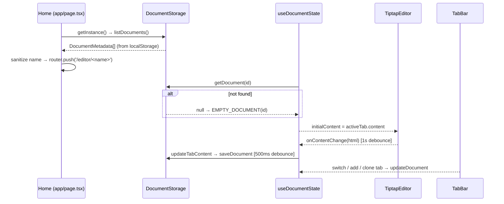
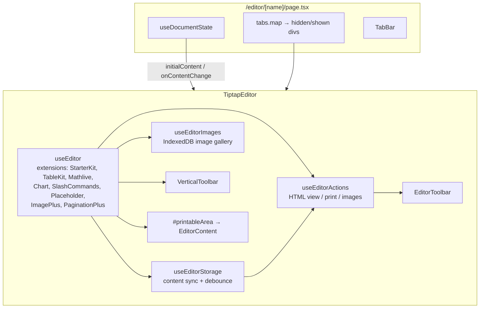
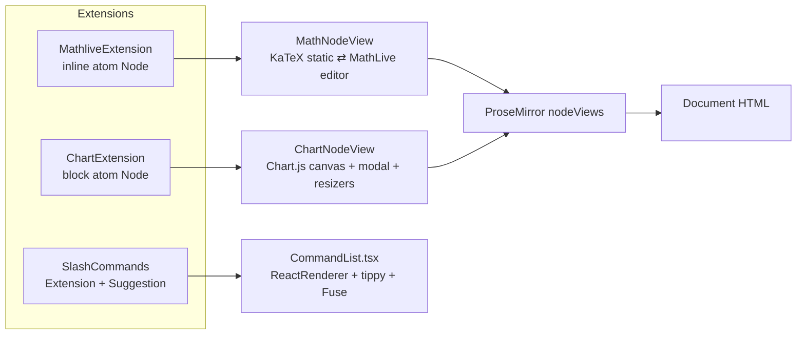

# Architecture — Leaf (Lab Report Generator)

> Deep analysis of the application's architecture, data flow, and design decisions.
> Generated from a full source scan (August 2026). ~4,000 lines of first-party code.

---

## 1. Overview

**Leaf** is a client-side web application for generating physics lab reports. Users create
documents, optionally feed them with experiment images (theory, data tables, calculations,
discussion), and an AI model drafts a structured report (theory + common data/calculations +
results & discussion) with multiple interchangeable variants. The report is edited in a
feature-rich WYSIWYG editor (Tiptap/ProseMirror) with special support for **LaTeX math** and
**least-squares curve-fit charts**, paginated for A4 printing.

Despite running on Next.js, the application is effectively a **client-only SPA**: every page is
`'use client'`, the editor is dynamically imported with `ssr: false`, and all persistence is
browser-side (IndexedDB + localStorage). There is no backend database; the only server-side code
is one Next.js Server Action that proxies AI generation.

### Purpose & primary flows

| Flow | Description |
|---|---|
| **Document management** | Create / list / delete documents on the home page. |
| **Editing** | Multi-tab document editor with rich text, math, charts, tables, HTML source view, print. |
| **AI generation** *(currently disconnected — see §7)* | 4-step wizard → uploads images → server action → LLM returns 3+1+3 HTML variants → editor content. |

---

## 2. Technology Stack

| Concern | Technology | Notes |
|---|---|---|
| Framework | **Next.js 16.2.4** (App Router) | Used almost exclusively as a client renderer |
| UI | **React 19.2.4** + TypeScript 5 (strict) | |
| Styling | **Tailwind CSS 4** + CSS variables | Theming via `[data-theme]` + custom props |
| Editor | **Tiptap 3.22** / **ProseMirror** (`@tiptap/pm`) | Custom vanilla NodeViews for chart & math |
| Math | **KaTeX** (static render) + **MathLive** (inline editing) | `math-field` web component |
| Charts | **Chart.js 4** + **ml-levenberg-marquardt** | Least-squares curve fitting, 11 models |
| AI | **Vercel AI SDK 6** + **ai-gateway-provider** (Cloudflare AI Gateway) → Gemini 2.5 Flash | Structured-output JSON via zod |
| Persistence | **IndexedDB** (documents, images) + **localStorage** (metadata, theme) | RAM fallback |
| Misc | fuse.js (fuzzy command search), tippy.js (popovers), Radix Popover, lucide-react, zod 4 | |

---

## 3. Directory Structure & Responsibilities

```
├── app/                        # Next.js App Router — routes & server-side glue
│   ├── layout.tsx              # Root layout: fonts, ThemeProvider, global CSS
│   ├── page.tsx                # Home — document list / create / delete
│   ├── globals.css             # Theme variables + aggressive editor styling
│   └── editor/
│       ├── page.tsx            # Bare editor route (no document state — dev/leftover route)
│       ├── [name]/page.tsx     # Real editor route — tabbed document editor
│       ├── hooks/useDocumentState.ts    # Document lifecycle + debounced persistence
│       └── actions/generateVariantsAction.ts  # Server Action: AI generation (unused)
│
├── components/
│   ├── editor/
│   │   ├── TiptapEditor.tsx    # Composition root — editor instance, toolbars, print CSS
│   │   ├── EditorToolbar.tsx   # Top floating toolbar (tables, images, HTML view, print)
│   │   ├── VerticalToolbar.tsx # Left floating toolbar (headings, marks, lists)
│   │   ├── TabBar.tsx          # Bottom tab bar + theme switcher
│   │   ├── MenuBar.tsx         # ⚠️ Unused (superseded by Editor/VerticalToolbar)
│   │   ├── VariantToolbar.tsx  # ⚠️ Unused (AI variant switcher — never wired in)
│   │   ├── ModalStepper.tsx    # ⚠️ Unused (4-step AI input wizard — never mounted)
│   │   ├── constants.ts        # ⚠️ Unused (AI prompt text, cover templates)
│   │   ├── hooks/              # useEditorStorage / useEditorActions / useEditorImages
│   │   └── plugins/            # ProseMirror extensions (see §5)
│   └── common/ToastContainer.tsx  # ⚠️ Unused (toast UI without a host)
│
├── lib/                        # Domain logic (framework-free where possible)
│   ├── types.ts                # Document / Tab / VariantContent / Input models
│   ├── documentStorage.ts      # IndexedDB wrapper with RAM fallback (singleton)
│   ├── ThemeContext.tsx        # light / dark / hybrid theme provider
│   ├── generateVariants.ts     # AI call + prompt building + JSON parsing
│   ├── parseVariants.ts        # AI output validation + HTML section wrapping
│   ├── editorCommands.tsx      # Slash-command registry (also duplicated in EditorToolbar)
│   ├── imageToBase64.ts        # ⚠️ Unused
│   ├── useToast.ts             # ⚠️ Unused (paired with ToastContainer)
│   └── utils.ts                # cn() class merge helper
│
├── next.config.ts              # serverActions bodySizeLimit: 20mb
├── bun.lock / package-lock.json / packageggggg-lock.jsonfhjkkyrd / olfd  # ⚠️ 4 lockfiles
└── public/                     # Default create-next-app SVGs only
```

---

## 4. Architectural Layers & Data Flow

### 4.1 System context

```mermaid
flowchart LR
    subgraph Browser
        UI[React UI<br/>app/ + components/]
        EDITOR[Tiptap Editor<br/>ProseMirror + NodeViews]
        STORE[DocumentStorage<br/>IndexedDB + localStorage + RAM]
        THEME[ThemeProvider<br/>CSS variables]
    end

    subgraph Server (Next.js)
        SA[Server Action<br/>generateVariantsAction]
    end

    subgraph External
        GW[Cloudflare AI Gateway]
        LLM[Gemini 2.5 Flash]
    end

    UI --> EDITOR
    EDITOR -->|debounced HTML| UI
    UI <--> STORE
    UI --> SA
    SA --> GW --> LLM
    LLM -->|JSON variants| SA
    SA -->|editor HTML| UI
```

### 4.2 Document lifecycle



Key design points:

- **Single source of truth:** the `Document` object held in `useDocumentState`; the editor is a
  controlled-ish view that emits HTML back through `onContentChange`.
- **Two debounce layers:** `useEditorStorage` debounces editor→state by **1 s**; `useDocumentState`
  debounces state→IndexedDB by **500 ms**.
- **RAM-first persistence:** `DocumentStorage` writes to an in-memory `Map` synchronously (primary),
  then mirrors to IndexedDB asynchronously. Reads hit RAM first. If IndexedDB is unavailable,
  the app silently degrades to RAM-only (data lost on reload).
- **Metadata is separate:** the document list lives in `localStorage['documents']`, not IndexedDB —
  so the home page never needs to open the DB.

### 4.3 Editor composition



Notable behaviors:

- **Every tab keeps its own mounted `TiptapEditor`.** Inactive tabs are hidden with CSS
  (`display: hidden`), so N tabs = N live ProseMirror instances. Simple, but scales poorly.
- The editor is **not fully controlled**: `initialContent` is only applied if the current content
  is the default placeholder (`<p></p>`) or contains the leftover string `'Stable Custom H1'`
  (a relic of an older version).
- Print is handled via an inline `<style>` block in `TiptapEditor` (the `@media print` rules in
  `globals.css` are **commented out**) — visibility toggling around `#printableArea` + `window.print()`.

---

## 5. Editor Plugin Architecture (ProseMirror)

The most sophisticated part of the system. Three custom extensions, all built against the vanilla
ProseMirror API (`@tiptap/pm`) rather than React — a deliberate "React shell, vanilla core" split.



### 5.1 `MathliveExtension` — inline math

- **Atom inline node** parsing `<math>`/`<math-field>` tags; serializes back to
  `<math data-latex="...">`.
- **Dual-mode NodeView:** static KaTeX render by default; clicking swaps to a live
  `<math-field>` (MathLive) for editing. MathLive is **dynamically imported on first edit**
  (SSR-safety + code-splitting).
- Edits dispatch `setNodeMarkup` transactions back into ProseMirror on `input`; blur (with a
  200 ms grace check) returns to KaTeX static mode.

### 5.2 `ChartExtension` — data charts with curve fitting

- **Atom block node** parsing `<chart data-datasets='[...]' .../>`; attributes for datasets
  (as JSON string), x/y labels, width/height/alignment.
- **ChartNodeView** (≈700 lines): renders a Chart.js **scatter + fitted-line** chart per dataset,
  an equation/R² info panel, hover toolbar (edit/align/delete), and corner/edge **resizers** that
  update node attributes on drag end.
- **`chartFitting.ts`** wraps `ml-levenberg-marquardt` to fit 11 models (linear, exponential,
  logarithmic, sine, cosine, tangent, power, logistic, polynomial deg-3, gaussian, linear-y=mx)
  with per-model initial values, bounds, domain normalization, R², and a 120-point curve.
- Empty charts auto-open the data editor modal (rows of x/y inputs, multi-dataset support).

### 5.3 `SlashCommands` — command palette

- Tiptap `Suggestion` on `/` + `ReactRenderer` (CommandList) + tippy.js popover + **Fuse.js**
  fuzzy search over `getAllCommandList(editor)` (~40 commands: history, formatting, headings,
  lists, alignment, inserts, table ops).
- Command definitions in `lib/editorCommands.tsx` — but note **the table-action logic is
  duplicated** there and in `EditorToolbar.tsx` (DRY violation).

---

## 6. Theming & Styling Architecture

- **Three themes:** `light`, `dark`, `hybrid` (dark chrome + light editor page), driven by
  `ThemeContext` (`lib/ThemeContext.tsx`) which sets `document.documentElement[data-theme]` and
  persists to `localStorage['leaf-theme']`.
- **Token system:** ~20 CSS custom properties (`--bg-app`, `--bg-toolbar`, `--fg-editor-page`,
  `--accent`, …) defined per theme in `globals.css`; components consume them via Tailwind
  arbitrary values (`bg-[var(--bg-toolbar)]`). This gives theme switching without class churn.
- **Aggressive editor CSS:** `globals.css` forces heading sizes (32pt/24pt), table borders,
  list markers, blockquotes, A4 page dimensions (`min-height: 29.7cm`, `padding: 2cm`) with
  `!important` — the editor is styled to look like a printed physics report, not a web page.
- **Pagination:** `tiptap-pagination-plus` renders A4 pages (`PAGE_SIZES.A4`) with page-break
  elements; print CSS in `TiptapEditor`'s inline `<style>` handles the `@media print` output.

---

## 7. AI Generation Pipeline ⚠️ (currently dead code)

The AI feature is fully implemented but **not reachable from the UI**:

```mermaid
flowchart LR
    MS[ModalStepper<br/>4-step wizard] -->|FormData<br/>images + comments| SA[generateVariantsAction<br/>Server Action]
    SA --> GF[generateVariantsFromBlobs<br/>blob → base64 data URLs]
    GF --> GV[generateVariants<br/>prompt + AI SDK call]
    GV --> GW[Cloudflare AI Gateway<br/>accountId hardcoded]
    GW --> LLM[Gemini 2.5 Flash<br/>system prompt: HTML + <chart> tags]
    LLM -->|text| P[parseJsonFromText<br/>strip code fences / braces]
    P --> Z[zod VariantOutputSchema<br/>3 theory + 1 common + 3 discussion]
    Z --> PV[parseVariants<br/>validation + HTML section wrapping]
    PV --> BE[buildEditorContent<br/>sections with data-variant attrs]
    BE --> DOC[Document.aiOutput / editorContent / selectedVariants]
```



Findings:

1. **`ModalStepper` is never imported** — no route or component mounts it. The entire pipeline
   (wizard → server action → AI call → variant parsing) is unreachable.
2. **Hardcoded credentials:** `accountId: '9ada87e1043c02fee3a42cf500922832'` is committed in
   `lib/generateVariants.ts`, while `token = ""` is hardcoded *empty* — the call **always throws**
   `'CF_AIG_TOKEN environment variable not set'` even if wired up.
3. **Prompt drift:** the live prompt in `generateVariants.ts` and the (unused)
   `LAB_REPORT_PROMPT_TEXT` in `constants.ts` have diverged.
4. **Variant switching UI exists but is orphaned:** `VariantToolbar` (T1–T3 / R1–R3 switcher)
   was built for the AI flow but is never rendered; `Document.selectedVariants` is persisted but
   never consumed.
5. `next.config.ts` sets `serverActions.bodySizeLimit: '20mb'` specifically for this flow.

---

## 8. Persistence Architecture

| Store | Where | Contents | Notes |
|---|---|---|---|
| IndexedDB `LeafDocuments` / `documents` | `lib/documentStorage.ts` | Full `Document` JSON | Serialization **strips all Blob images** (`images: []`) |
| IndexedDB `LeafDocuments` / `images` | `lib/documentStorage.ts` | Per-doc image blobs | Deleted alongside document; never written by current code |
| IndexedDB `leaf-editor-images` / `uploadedImages` | `useEditorImages.ts` | Last 12 uploaded image data-URLs | Editor image gallery |
| localStorage `documents` | `documentStorage.ts` | `DocumentMetadata[]` | Home-page list |
| localStorage `leaf-theme` | `ThemeContext.tsx` | `'light'\|'dark'\|'hybrid'` | |

**Critical risk:** `_serializeDocument` explicitly sets `inputs.*.images = []`, and nothing
re-populates them on load — **uploaded experiment images are lost on reload**. The RAM fallback
also means the app can silently run with zero durability if IndexedDB is blocked.

---

## 9. Dead Code, Redundancies & Debt

Confirmed by reference scanning (defined but never imported):

| Item | Status |
|---|---|
| `ModalStepper.tsx` (457 lines) | Unused — AI wizard |
| `VariantToolbar.tsx` | Unused — variant switcher |
| `MenuBar.tsx` (233 lines) | Unused — superseded by EditorToolbar + VerticalToolbar |
| `ToastContainer.tsx` + `lib/useToast.ts` | Unused — no host component |
| `lib/imageToBase64.ts` | Unused (duplicate of blob→dataURL logic in `generateVariants.ts`) |
| `lib/constants.ts` (`LAB_REPORT_PROMPT_TEXT`, `COVER_TEMPLATES`) | Unused |
| `lib/parseVariants.ts` | Used only by the dead server action |
| `app/editor/actions/generateVariantsAction.ts` | Used only by dead ModalStepper |
| `app/editor/page.tsx` (bare editor route) | No document state, no tabs — likely leftover |
| `app/editor/hooks/useDocumentState.ts → updateInputs/setEditorContent/error` | `updateInputs` only used by dead code; `error` surfaced generically |

**Dependencies declared but never imported** (from `package.json` vs. source scan):
`jspdf`, `modern-screenshot`, `recharts`, `turndown` (+ `@types/turndown`), `@ai-sdk/anthropic`,
`@ai-sdk/openai`, `react-mathlive`, `tiptap-table-plus`, `@types/chart.js` (stub package),
`tiptap-image-plus` (used), `install` (a known no-op npm package — should be removed).

**Repository hygiene:**
- **Four lockfiles:** `bun.lock` (used by dev), `package-lock.json` (untracked), and two *tracked*
  artifacts: `packageggggg-lock.jsonfhjkkyrd` and `olfd` (a lockfile copy). Mixed package-manager
  signals.
- `public/` contains only create-next-app boilerplate SVGs.
- No tests, no CI config, no `.env.example` (important: the AI token is missing).

---

## 10. Security & Robustness Observations

1. **XSS surface:** AI-generated HTML and the HTML source view are parsed into the editor
   (`setContent`). ProseMirror/Tiptap sanitize to the schema, but `<math>`/`<chart>` custom tags
   and `data-latex`/`data-datasets` attributes flow from untrusted model output into the DOM.
   The inline `<style dangerouslySetInnerHTML>` in `TiptapEditor` is static (safe), but the
   pattern invites caution.
2. **Hardcoded API account ID** committed to source (§7).
3. **No auth, no backend, no sync:** all data is device-local; clearing browser storage destroys
   all documents.
4. **`confirm()`/`alert()`/`window.prompt()`** used for delete confirmations and links — functional
   but inconsistent with the rest of the polished UI.
5. `decodeURIComponent(params.name)` on the editor route vs. sanitized names on create — safe for
   the sanitizer output, but decoding is unguarded (can throw on malformed input).
6. Chart/math NodeViews manipulate the DOM directly and rely on `ignoreMutation() → true`; any
   mismatch between ProseMirror state and DOM can silently desync (e.g., resizer attrs are only
   committed on `mouseup`).

---

## 11. Strengths & Recommendations

### What works well
- **Clean layering:** routes → document state → editor → plugins → lib utilities are mostly
  separable; `lib/` is framework-light.
- **Thoughtful persistence abstraction:** singleton storage with RAM-first caching and graceful
  fallback; debounced writes.
- **Impressive plugin depth:** dual-mode math (KaTeX/MathLive), least-squares chart fitting with
  11 models, resizable charts, fuzzy slash commands — a genuinely rich editor.
- **Token-based theming** makes the light/dark/hybrid system cheap to extend.

### Recommended next steps (roughly in priority order)
1. **Reconnect or delete the AI pipeline** — mount `ModalStepper` (e.g., from the document
   page), move `CF_AIG_TOKEN` to env, and remove the hardcoded account ID.
2. **Fix image persistence** — store blobs in the IndexedDB `images` store (it already exists!)
   and restore them on load, or persist data-URLs.
3. **Delete dead code** — `MenuBar`, `VariantToolbar`, `ToastContainer`/`useToast`,
   `imageToBase64`, `constants.ts`, the bare `/editor` route; prune unused deps
   (`jspdf`, `recharts`, `turndown`, `modern-screenshot`, `install`, …).
4. **Consolidate lockfiles** — pick one package manager, delete `olfd` and
   `packageggggg-lock.jsonfhjkkyrd`.
5. **Refactor duplicated table logic** — `EditorToolbar.tsx` and `editorCommands.tsx` share the
   same table-action definitions; extract once.
6. **Reconsider the always-mounted tab editors** — lazy-mount or destroy inactive editors to cut
   memory, or keep only the active tab mounted.
7. **Add tests** — at minimum for `chartFitting` (pure math), `parseVariants`, and
   `DocumentStorage`; plus a CI lint/typecheck step.
8. **Harden content handling** — sanitize AI-generated HTML before `setContent`, guard
   `decodeURIComponent`, and add an `.env.example`.

---

## Appendix A — Module dependency map

```mermaid
flowchart TB
    subgraph Routes
        Home[app/page.tsx]
        EdBare[app/editor/page.tsx]
        EdName[app/editor/[name]/page.tsx]
        Layout[app/layout.tsx]
    end

    subgraph Editor
        TE[TiptapEditor]
        ET[EditorToolbar]
        VT[VerticalToolbar]
        TB[TabBar]
        US[useEditorStorage]
        UA[useEditorActions]
        UI[useEditorImages]
        CE[ChartExtension] --> CF[chartFitting]
        ME[MathliveExtension]
        SC[SlashCommands] --> CL[CommandList] --> EC[editorCommands]
    end

    subgraph Domain
        DS[documentStorage] --> T[types]
        DS[documentState] --> T
        GV[generateVariants] --> PV[parseVariants]
    end

    Layout --> Theme[ThemeContext]
    Home --> DS
    EdName --> DS --> TE
    EdName --> TB
    TE --> ET & VT & US & UA & UI
    TE --> CE & ME & SC
    EdName --> DSH[useDocumentState] --> DS
    MS[ModalStepper - DEAD] --> SA[generateVariantsAction] --> GV
```

## Appendix B — Key files by size

| File | Lines | Role |
|---|---|---|
| `components/editor/plugins/ChartExtension.ts` | 694 | Chart NodeView + editor modal |
| `components/editor/ModalStepper.tsx` | 457 | ⚠️ Dead AI wizard |
| `components/editor/plugins/chartFitting.ts` | 296 | Least-squares fitting engine |
| `components/editor/EditorToolbar.tsx` | 295 | Top toolbar (tables/images/print) |
| `components/editor/MenuBar.tsx` | 233 | ⚠️ Dead toolbar |
| `components/editor/TiptapEditor.tsx` | 221 | Editor composition root |
| `lib/documentStorage.ts` | 213 | IndexedDB wrapper |
| `components/editor/plugins/MathliveExtension.ts` | 241 | Math NodeView |
| `lib/generateVariants.ts` | 149 | AI call + prompt |
| `lib/editorCommands.tsx` | 128 | Slash command registry |